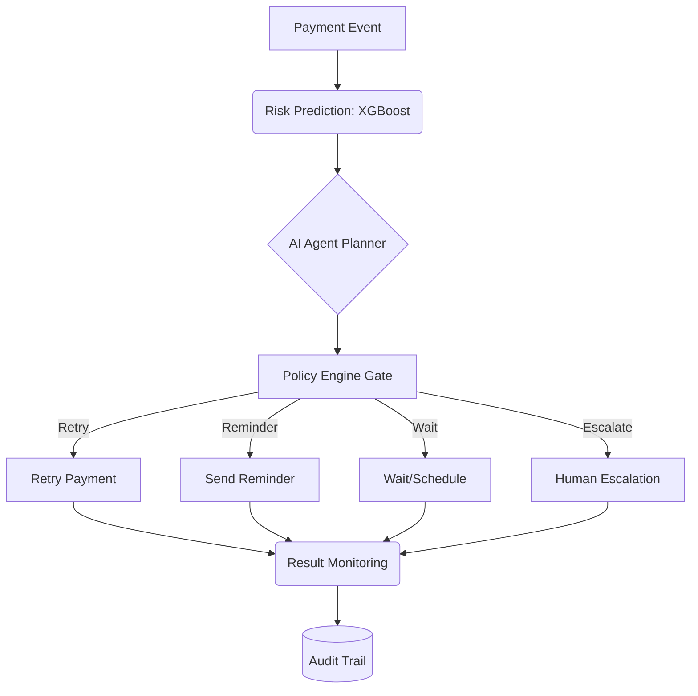

# RecoverAI

### AI-Powered Revenue Recovery Agent

RecoverAI is an AI-powered payment recovery system that detects revenue at
risk, predicts the probability of payment recovery, selects an appropriate
recovery intervention, and executes a bounded recovery workflow — with a
full audit trail and financial safety limits.

Built for Razorpay's Buildathon Track 03: an agent that detects revenue at
risk, chooses an intervention, executes a bounded recovery workflow, and
demonstrates measured money recovered, compliant escalation, stopping
rules, and an audit trail.

## Problem

Failed payments and abandoned transactions create significant revenue
leakage for merchants. Traditional systems detect failures but don't
intelligently decide what to do next. RecoverAI closes that loop.

## Architecture



### Demo Video

*Placeholder for demo video link. We recommend recording a quick 3-minute walkthrough using Loom that covers: (1) The problem, (2) The architecture, (3) A tour of the Streamlit dashboard, (4) An example of a successful automated recovery.*

The ML model predicts recovery probability. The LLM explains the decision
in plain English. Neither one decides whether money moves — that decision
is made exclusively by the deterministic policy engine (`src/agent/policy.py`).

## Results (real, from this repo's own experiment)

All numbers below come from running the actual trained model and agent over
the held-out **test set (7,500 payments, never touched during training)**.
Nothing here is invented — regenerate them yourself with `src/simulate.py`.

### ML model (`docs/ml_metrics.json`)

| Metric | Value |
|---|---|
| Accuracy | 0.71 |
| Precision | 0.71 |
| Recall | 0.76 |
| F1 Score | 0.73 |
| ROC-AUC | 0.77 |

Confusion matrix: `[[TN=2366, FP=1220], [FN=951, TP=2963]]`

### Business impact (`docs/business_metrics.json`)

| Metric | Value |
|---|---|
| Payments analyzed | 7,500 |
| Revenue at risk | ₹1,49,38,865 |
| Potentially recoverable | ₹1,15,67,847 |
| Revenue recovered | ₹65,43,679 |
| Recovery rate | 43.8% |
| Human escalations | 1,800 |
| Failed recovery attempts | 4,198 |

### Baseline comparison (`docs/baseline_comparison.json`)

| Strategy | Recovery Rate | Revenue Recovered |
|---|---|---|
| No intervention | 0.0% | ₹0 |
| Always retry (blind) | 42.5% | ₹63,54,930 |
| **RecoverAI** | **43.8%** | **₹65,43,679** |

RecoverAI beats blind retry-everything not because of a bigger model, but
because of the **policy layer**: it retries transient failures (bank
timeouts, network errors) directly, sends reminders for things a retry
can't fix (expired cards), waits out temporary issues (insufficient
funds), and escalates high-value or low-confidence cases to a human — all
within hard financial limits. See "How the baseline comparison works"
below for exactly how blind retry was modeled to keep this comparison fair.

## Safety controls

- Maximum retries per payment: 2
- Minimum retry interval: 6 hours
- Maximum automated recovery amount: ₹10,000 (above this → human escalation)
- Never retries after `card_expired` (a resubmission cannot fix an expired card)
- Never retries after a customer requests STOP
- Escalates to a human after repeated failure or when confidence is low
- Full audit log for every decision (`GET /audit/{payment_id}`)

RecoverAI does not claim "AI controls payments." It recommends and executes
only bounded actions permitted by the policy engine; uncertain or high-risk
cases are escalated to a human.

## How the baseline comparison works

- **No intervention**: 0% recovery, by definition.
- **Always retry (blind)**: every failed payment gets one retry attempt,
  regardless of failure reason. Recovery success uses the model's base
  probability scaled by a *retry-effectiveness* factor per failure type
  (a retry fixes ~100% of bank timeouts but only ~5% of expired cards,
  since resubmitting the same card doesn't un-expire it).
- **RecoverAI**: the trained model's probability, routed through the
  policy engine to the correct action, each with its own realistic success
  model (see `src/agent/tools.py`).

## Tech stack

Python · FastAPI · Streamlit · XGBoost · SQLAlchemy (SQLite by default,
Postgres-ready) · Razorpay Test Mode APIs (optional, not required to run)

## Dataset

50,000 synthetic payment records with deliberately noisy failure/recovery
outcomes (see `data/generate_dataset.py`) — no real customer data is used
anywhere in this project.

## Project structure

```
recoverai/
├── data/                  # dataset generator + train/val/test splits
├── models/                # trained XGBoost model + encoders
├── src/
│   ├── ml/                # preprocessing, train, evaluate
│   ├── agent/              # policy engine, tools, planner, explanations
│   ├── database/          # SQLAlchemy models + CRUD
│   ├── api/                # FastAPI app
│   └── simulate.py         # full test-set simulation + baseline comparison
├── dashboard/              # Streamlit app (5 pages)
├── tests/                  # pytest suite (22 tests, all passing)
└── docs/                   # generated metrics (ml_metrics.json, business_metrics.json, baseline_comparison.json)
```

## Installation

```bash
git clone <repository-url>
cd recoverai
python -m venv venv
source venv/bin/activate   # Windows: venv\Scripts\activate
pip install -r requirements.txt
```

## Reproducing the results from scratch

```bash
# 1. Generate the synthetic dataset (50,000 records)
python data/generate_dataset.py

# 2. Split into train/val/test and build the feature encoder
python src/ml/preprocessing.py

# 3. Train the XGBoost model
cd src/ml && python train.py && cd ../..

# 4. Evaluate on the held-out test set -> docs/ml_metrics.json
cd src/ml && python evaluate.py && cd ../..

# 5. Run the full agent simulation + baseline comparison
python src/simulate.py
```

## Run the API

```bash
uvicorn src.api.main:app --reload
```

Endpoints:
- `GET /health`
- `GET /payments/{payment_id}`
- `POST /predict`
- `POST /agent/recover/{payment_id}`
- `GET /audit/{payment_id}`
- `GET /analytics/summary`

## Run the dashboard

```bash
streamlit run dashboard/app.py
```

Five pages: Overview, Payment Risk, Agent Decisions, Recovery Analytics, Audit Trail.

## Run the tests

```bash
pytest tests/ -v
```

22 tests covering the policy engine, the agent end-to-end, model integrity
(including a regression test that the model never uses `recovery_action` as
an input feature — see "A bug we caught" below), and the API.

## A bug we caught during development

The model was initially trained with the *historical* `recovery_action` as
an input feature. This is circular: the whole point of the agent is to
*decide* the action, so it can't also depend on knowing the action in
advance. We removed the feature, retrained, and confirmed accuracy barely
moved (ROC-AUC 0.7684 vs. 0.7706) — proof the feature wasn't carrying real
signal, it was just leaking the decision. `tests/test_model.py` now
regression-tests this.

## Environment variables

See `.env.example`. All are optional — the project runs end-to-end on
SQLite with no external API keys. Set `ANTHROPIC_API_KEY` to have the
explanation layer call a real LLM instead of its template fallback; set
`RAZORPAY_KEY_ID` / `RAZORPAY_KEY_SECRET` to wire up Razorpay Test Mode.

## Disclaimer

This project uses synthetic data only. No real customer payments are
processed. Recovery actions in the simulation are modeled/simulated, not
executed against a live payment gateway.

## License

MIT
